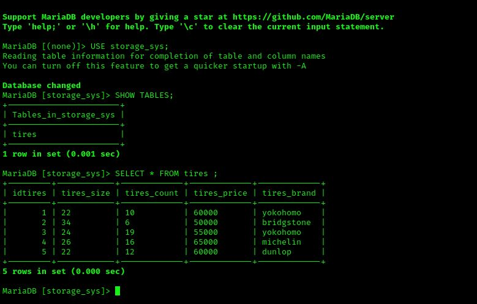
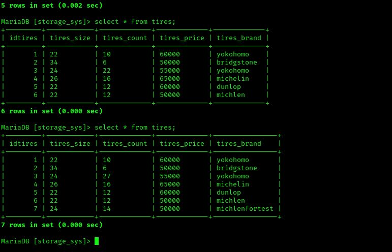

# Project Overview

This project was developed using a **LAMP stack** (Linux, Apache, MySQL/MariaDB, PHP).  
The goal was to design and implement a functional application that demonstrates backend integration with a database and a usable frontend interface.

---

## Development Process

- **Backend (LAMP Stack):**  
  The application was built on a traditional LAMP stack, providing a stable and reliable environment for development.  
  - **Linux** served as the operating system.  
  - **Apache** handled web server functionality.  
  - **MySQL/MariaDB** was used as the database engine.  
  - **PHP** powered the server-side logic and handled data flow between the frontend and backend.

- **Frontend Development:**  
  Since I am not primarily a frontend developer and did not have a team, I utilized **AI assistance** to help structure and design the frontend. This allowed me to:  
  - Quickly create an organized and responsive layout.  
  - Implement UI components efficiently.  
  - Focus more on backend logic while still delivering a functional and presentable interface.  

---

## Features

- Database integration with CRUD operations.  
- Secure communication between frontend and backend.  
- Simple, responsive user interface.  
- Easy deployment in a LAMP environment.

---

## Demonstration

Below are examples to illustrate the project functionality:

- **Screenshot 1: [SQL Database]**  
  

- **Demo Video:**  
  [▶ Watch Demo Video](./assets/demo.mp4)

- **Screenshot 2: [SQL Database after editing]**  
  

---

## Conclusion

This project demonstrates my ability to:  
- Set up and configure a **LAMP stack** environment.  
- Implement backend logic and connect it to a relational database.  
- Use **AI-assisted tools** to overcome frontend challenges and still deliver a professional-looking product.  

While the frontend was not the main focus, the use of AI enabled me to achieve a working design and ensure the project is accessible and functional for end users.
